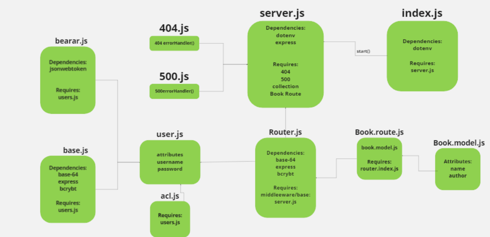

# Book-shop

[gitHub](https://github.com/alsatarysamah/Book-shop)

[PR](https://github.com/alsatarysamah/Book-shop/pull/2#partial-pull-merging)

[Action](https://github.com/alsatarysamah/Book-shop/actions)

[heroku](https://ms-book-shop.herokuapp.com/)

Book shop is designed to handle user registration and sign in using Basic, Bearer, or OAuth along with a custom “authorization” module that will grant/deny users access to the Book-shop server based on their role or permissions level.the roles are:

 1-user: ['read'] from the  Books table,
           
2- writer: ['read', 'create'] from the Books table,

3-  editor: ['read', 'create', 'update'] from the Books table,

 4-  admin: ['read', 'create', 'update', 'delete'] from the  Books table

# UML

## User Routes

POST /signup to create a user

POST /signin to login a user and receive a token

GET /secret should require a valid bearer token

GET /users should require a valid token and “delete” permissions

##  Books Routes

these routes have **bearer** and **acl** middlewares:

1-POST /book adds an item to the DB and returns an object with the added item

2-GET /book returns a list of :model items

3-GET /book/:id returns a single item by ID

4-PUT /book/:id  returns a single, updated item by ID

5-DELETE /book/:id  returns an empty object. 

{
    "name":"first item",
    "assignedTo":"samah",
    "difficulty":"1"
}

{
    "username":"s",
    "password":"123",
    "role":"admin"
}
